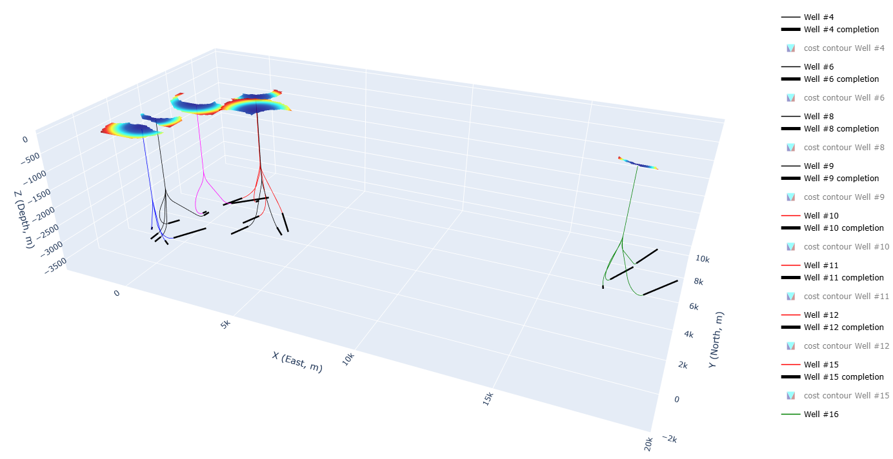

# WelLayout_API
This repository provides examples of using WelLayout API which provides the field layout optimization under various constraints with extreme efficiency.

This field layout optimization system API provides the following three functionalities:
- Automatic field-level layout design (K-sites-N-wells)  
- Automatic site-level layout design (1-site-N-wells)  
- Automatic trajectory design (1-well)  

It can manage a variety of constraints, including:
- dogleg  
- drill site location limit  
- trajectory torquosity (e.g., turning angle control for torque & drag)  
- dangerous zones in the formation  
- anticollision with offset wells (only available for 1-well mode)

Parametric design pattern let you say good-bye to manual trial-and-errors on the trajectory geometry and the whole field layout to fulfill various constraints.

-----------------------------------------------------------

The basic framework of this field layout optimization system was established during my PhD in NTNU-SUBPRO research team, and published in a series of 3 journal papers:  

Subsea field layout optimization:  
https://doi.org/10.1016/j.petrol.2021.109450  
https://doi.org/10.1016/j.petrol.2021.109273  
https://doi.org/10.1016/j.petrol.2021.109336  

Many improvements have been made over orginal work.For example, the complex single well trajectory design (1-well):  
Trajectory design with constraints (except anticollision):  
https://doi.org/10.2118/216997-ms  

Sidetrack trajectory design (to be updated in the API):  
https://doi.org/10.2118/201021-ms  

Trajectory design with anticollision:  
(To be submitted soon ...)

Currently, this test server has very limited computing power, but it still just takes several seconds for a case (except the anticollision case which takes around 4 minutes).

__Run the \*.ipynb under /Demos/... to see the examples of using WelLayout API.__
================================================================

Here shows some examples of the optimization results, **click the figures for interactive 3D visualization**.
## 1-well (Single well trajectory design)
Avoiding dangerous area in the formation (at a specific depth): /Demos/get_1well/1well_ex1.ipynb   

Anticollision with safety distance functions related to measured depth: /Demos/get_1well/1well_ex2.ipynb   

## 1-site-N-wells (site-level layout design)
Without additional constraints, limited by DLS only: /Demos/get_1site/1site_ex1.ipynb   

Avoiding dangerous area + inclination control at a specific depth (for 2nd well ≤36°): /Demos/get_1site/1site_ex2.ipynb   

## K-sites-N-wells (field-level layout design)
Number of sites limited: /Demos/get_ksites/ksites_ex1.ipynb   

(To be continued ...)
# You are most welcome to contribute your case studies to this repository!
