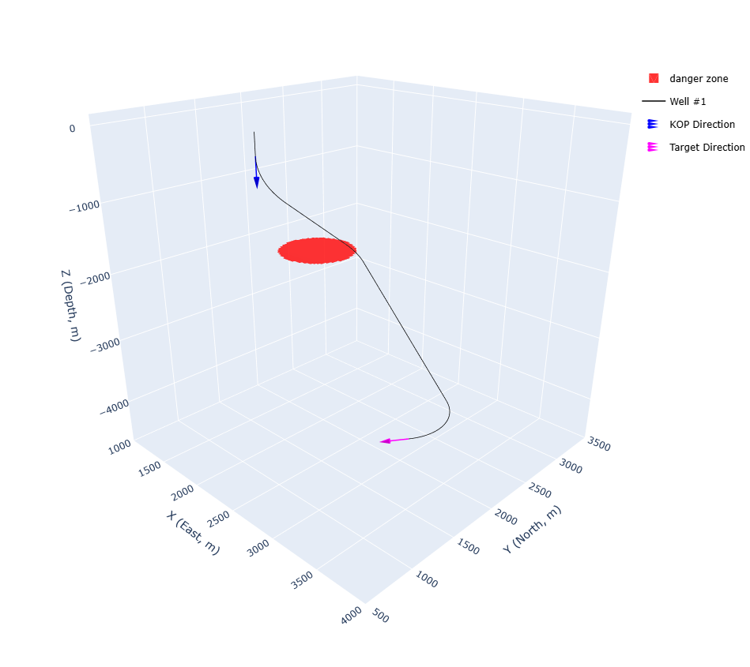

# WelLayout_API
This repository provides examples of using WelLayout API which provides the field layout optimization under various constraints.

The basic technical methods/ideas are created during my PhD work in NTNU-SUBPRO research team, and published in a series of 3 journal papers:  

https://doi.org/10.1016/j.petrol.2021.109450

https://doi.org/10.1016/j.petrol.2021.109273

https://doi.org/10.1016/j.petrol.2021.109336

Many improvements have been made over the original papers' work. 
There is still more work to be done with the support from industrial partners.

=========================================================  
__Open the *.ipynb to see the examples of using WelLayout API.__

Here shows some examples of the optimization results:  
Single well trajectory under various constraints:  
(click the figure for interactive 3D visualization)

1-site-N-wells (site-level layout) under various constraints:
(click the figure for interactive 3D visualization)
